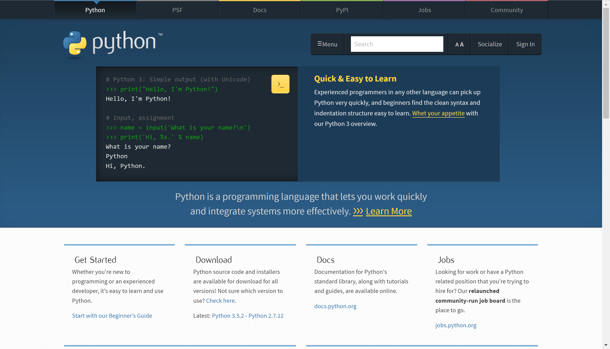
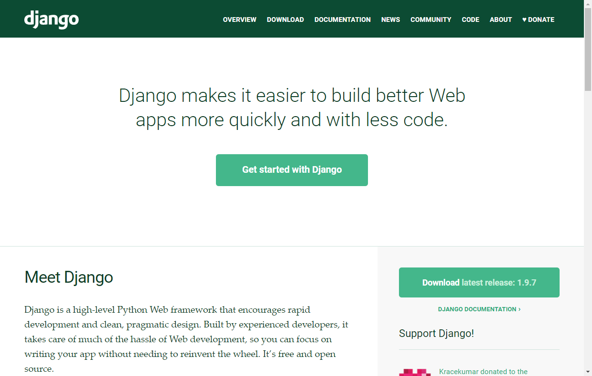
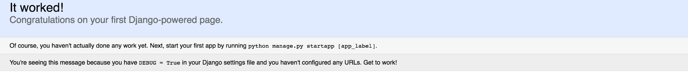
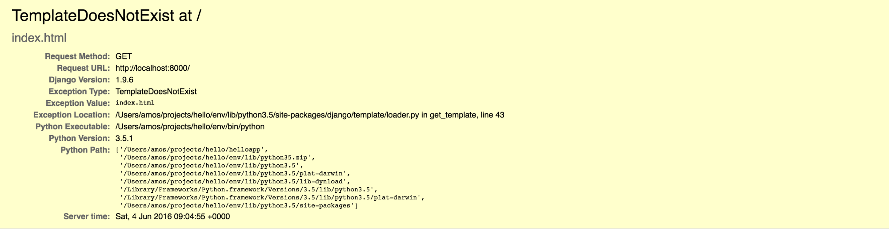
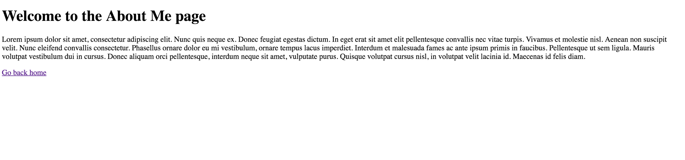

# Construa sua primeira aplicação em Django

Esse post é uma tradução [desse post](https://scotch.io/tutorials/build-your-first-python-and-django-application)

Você já deve ter ouvido falar do Python antes, especialmente se você já desenvolve por um tempo. Se não, Python é uma linguagem de programação de alto nível, de uso geral. Isso significa que você pode usar Python para desenvolver desde um jogo simples até um site com milhões de usuários por mês. Na verdade, vários sites que possuem milhões de visitantes por mês contam com Python para alguns de seus serviços. Exemplos incluem o [YouTube](https://www.youtube.com/) e o [Dropbox](https://www.dropbox.com/).


   
Dito isto, por que você deve usar Python em primeiro lugar? Por que não uma das muitas outras linguagens populares como Ruby ou PHP? Bem, com o Python você obtém os seguintes benefícios:

1. Sintaxe fácil
2. Comunidade incrível em torno da língua.
3. Fácil de aprender
4. O Python é útil para as mais variadas tarefas, desde o shell básico até o desenvolvimento avançado na web.

--- 

## Quando não usar o Python

Enquanto você pode facilmente escrever um aplicativo Desktop com Python usando ferramentas como [wxPython](http://http//www.wxpython.org/), você geralmente faria melhor usando ferramentas especializadas oferecidas por plataformas como .NET no Windows.

Você também não deve usar Python quando seu caso de uso específico tem requisitos muito especializados que são melhor atendidos por outros idiomas. Um exemplo é quando você está construindo um sistema incorporado, um campo no qual linguagens como C, C ++ e Java dominam.

---

## Python 2 vs Python 3

Python 2.7.x e 3.x ambos são usados extensivamente na web. O Python 3 introduziu alterações na linguagem que exigiu que as aplicações escritas em Python 2 fossem reescritas para trabalhar com Python 3.x. No entanto, a maioria das bibliotecas que você precisará usar agora foram portadas para Python 3.

Este tutorial usará Python 3 que está na versão 3.5.1 no momento da escrita. Os princípios permanecem os mesmos embora pequenas modificações de sintaxe serão necessárias para ser compatível com o Python 2.7.x.

---

## Alguns exemplos de código em Python

### HELLO WORLD

Como eu disse antes, um dos principais benefícios do Python é sua "sintaxe legível. Quão fácil? Confira a versão do Python do omnipresente Hello World.

```python
# This line of code will print "Hello, World!" to your terminal
print("Hello, World!")
```

Este código imprime Hello, World! para o console. Você pode facilmente experimentar esse código visitando [este site](https://repl.it/languages/python3), colando os exemplos de código no editor no lado direito da página e clicando no botão "executar" acima da página para ver o output.

### Lógica condicional

A lógica condicional é tão fácil quanto o Hello World. Aqui está algum código para verificar se a idade do usuário é acima de 18, e se for, para imprimir `Accesso permitido` ou `Accesso não permitido` caso contrário.

```python
# read in age
age = int(input("Qual sua idade?"))

if age >= 18:
    print("Accesso permitido")
elif age < 18 and age > 0:
    print("Accesso não permitido")
else:
    print("Idade inválida")
```

A função `input()` é usada para ler o que é digitado no teclado. Portanto, você precisará digitar algo no prompt do terminal após executar o script para que o restante do script seja executado. Observe que a função `input()` é envolvida na função `int()`.

Isso ocorre porque `input()` lê em valores como strings e ainda precisamos da idade ser um inteiro. Temos, portanto, que converter o input do teclado em uma string senão vamos obter um erro, por exemplo, quando verificar se a string é maior que 18.

Finalmente, observe a instrução `else` que é executada para qualquer outra entrada que não se enquadre nos critérios que estão sendo verificados no `if`.

---

## Tipos de dados abstratos

Python também possui tipos de dados abstratos nativos para armazenar coleções de itens. Um exemplo é uma lista que pode ser usada para manter variáveis de qualquer tipo. O código a seguir mostra como criar uma lista e iterar por ela para imprimir cada item no terminal.

```python
# Cria uma lista chamada my_list
my_list = [1, 2, 3, "python", 67,  [4, 5]]

# Faça o loop em my_list e dê um print em cada item
for item in my_list:
    print item
```

O código acima cria uma lista com números, uma string e uma lista (sim, as listas podem conter outras listas!). Para iterar através de listas, um loop `for-in` é útil. Lembre-se, as listas são indexadas por zero, para que também possamos acessar itens da lista usando índices. Por exemplo, para produzir a string `python`, você pode escrever:

```python
# create a list called my_list
my_list = [1, 2, 3, "python", 67,  [4, 5]]

print(my_list[3])
```

---

### Dicionários

Outro tipo de dados que o Python tem nativo são dicionários. Os dicionários armazenam chave e valor, parecido com objetos JSON. Criar um dicionário é simples:

```python
# create a dictionary
person = {
            "name": "Amos",
            "age": 23,
            "hobbies": ["Travelling", "Swimming", "Coding", "Music"]
        }

# iterate through the dict and print the keys
for key in person:
    print(key)

# iterate through the dict's keys and print their values
for key in person:
    print(person[key])
```

Agora vamos falar sobre Django

---

## Django



O Django é uma estrutura escrita em Python para a web. É livre e de código aberto já esta no mercado desde 2005. É um framework maduro, e vem com excelente documentação e recursos incluídos. 

Algumas ferramentas que fornece são:

1. Servidor leve para desenvolvimento e testes
2. Boa linguagem de template
3. Recursos nativos de segurança como CSRF

Há muitas outras coisas úteis incluídas no Django. Vamos usar o Django para construir nosso site neste tutorial.

---

## Configurando

Neste tutorial, vou mostrar como colocar um site do Django funcionando. Antes, pegue uma cópia do Python mais recente.

Se você está no mac você pode instalar o Python com o [brew](https://brew.sh/)

```bash
brew install python3
```

Depois de instalar a versão correta para o seu sistema operacional, você precisará certificar-se de que ele está configurado corretamente. Abra um terminal e digite:

```
python3
```

Você deve ver algo parecido com o seguinte:

```bash
Python 3.5.1 (v3.5.1:37a07cee5969, Dec  5 2015, 21:12:44) 
[GCC 4.2.1 (Apple Inc. build 5666) (dot 3)] on darwin
Type "help", "copyright", "credits" or "license" for more information.
>>> 
```

Este é o shell interativo do Python. Pressione `CTRL + D` para sair desse shell

---

## Configurando o ambiente

Para evitar poluir nosso escopo global com pacotes de Python, vamos usar um ambiente virtual para armazenar nossos pacotes para esse projeto específico. O gerenciador de ambiente virtual que vamos usar é o [virtualenv](https://virtualenv.pypa.io/en/stable/). E junto com ele vamos usar o [virtualenvwrapper](https://virtualenvwrapper.readthedocs.io/en/latest/) que é uma extensão do virtualenv que tornam os comandos do virtualenv muito mais fáceis através de atalhos.

Vamos usar o gerenciador de pacotes do Python `pip` para instalar este e outros pacotes como o Django, que precisaremos mais tarde. Primeiro, vamos instalar o virtualenv e o virtualenvwrapper.

```bash
pip install virtualenv
pip install virtualenvwrapper
```

Agora é preciso configurar as váriaves de ambiente no seu sistema operacional. Caso esteja no Mac, é preciso adicionar algumas linhas no arquivo de configuração de shell que você usa. **Mude os caminhos de acordo com as suas configurações.**

Edite o arquivo de acordo com o shell que você usa, Exemplo: `~/.bashrc`, `~/.zshrc`, etc...

```bash
# virtualenvwrapper

# Every virtualenv created will use this python
export VIRTUALENVWRAPPER_PYTHON=/usr/local/bin/python3

# Path to virtualenv executable
export VIRTUALENVWRAPPER_VIRTUALENV=/Library/Frameworks/Python.framework/Versions/3.6/bin/virtualenv

# Path to virtualenvs
export WORKON_HOME=$HOME/.virtualenvs

# Path to virtualenv project folders
export PROJECT_HOME=$HOME/Documents/python-venv-projects

# Runs virtualenvwrapper script
source /Library/Frameworks/Python.framework/Versions/3.6/bin/virtualenvwrapper.sh
```

Caso tenha dúvidas na configuração do virtualenvwrapper, ou precise instalar em outros sistemas operacionais, [veja mais detalhes aqui](http://virtualenvwrapper.readthedocs.io/en/latest/install.html)

Depois de instalados e configurados, crie um ambiente para o seu projeto:

```
mkproject [NOME_DO_PROJETO]
```

Esse comando acima cria um novo virtualenv na pasta definida em `WORKON_HOME`, e um novo diretório em `PROJECT_HOME`. Esse comando também irá ativar o ambiente virtual, e já irá te levar para a pasta do projeto que você acabou de criar.

---

## Instalando o Django

Com o seu ambiente virtual ativado, digite

```bash
pip install django
```

---

## Criando um app

Agora que o Django está instalado, vamos rodar o comando do Django que inicia um novo projeto.

```bash
django-admin startproject helloapp
```

Este comando cria um esqueleto de app com a seguinte estrutura:

```
helloapp
├─helloapp
│   ├── __init__.py
│   ├── settings.py
│   ├── urls.py
│   └── wsgi.py
└── manage.py
```

Quando você olha para a pasta helloapp que foi criada, você encontrará um arquivo chamado `manage.py` e outra pasta chamada `helloapp`. Esta é a pasta principal do projeto e contém as configurações do projeto em um arquivo chamado `settings.py` e as rotas do projeto no arquivo chamado `urls.py`. Abra o arquivo `settings.py` para se familiarizar com seu conteúdo.

---

## Mudando as configurações do App

Vamos mudar algumas configurações. Abra o arquivo `settings.py` no seu editor favorito. Encontre uma seção chamada `INSTALLED_APPS` que se parece com isso:

```python
# helloapp/settings.py
INSTALLED_APPS = [
    'django.contrib.admin',
    'django.contrib.auth',
    'django.contrib.contenttypes',
    'django.contrib.sessions',
    'django.contrib.messages',
    'django.contrib.staticfiles',
]
```

O Django opera com o conceito de apps. Um app é uma unidade de código autônoma que pode ser executada por conta própria. Um app pode fazer muitas coisas, como servir uma página da web no navegador ou manipular a autenticação do usuário ou qualquer outra coisa que você possa imaginar. O Django vem com alguns apps padrão pré-instalados, como apps de autenticação e gerenciador de sessões. Os apps que criaremos ou apps de terceiros que precisaremos serão adicionados na parte inferior da lista `INSTALLED_APPS`, logo após os apps instalados por padrão.

Antes de criar um app, vamos alterar o fuso horário da nossa aplicação. O Django usa os fuso horários da `base de dados tz`, cuja lista pode ser encontrada [aqui](https://en.wikipedia.org/wiki/List_of_tz_database_time_zones).

A configuração do fuso horário se parece com isso.

```python
# helloapp/settings.py
TIME_ZONE = 'UTC'
```

Altere para algo que faça mais sentido com o seu próprio fuso horário, como no exemplo abaixo:

```python
# helloapp/settings.py
TIME_ZONE = 'America/Los_Angeles'
```

---

## Criando seu próprio app

É importante notar que os apps do Django seguem a arquitetura Model, View, Template. Em poucas palavras, o app obtém dados de um Model, a View faz algo com os dados e, em seguida, renderiza um template contendo as informações processadas. **Os templates do Django correspondem as Views no MVC tradicional e as Views do Django podem ser comparadas aos Controllers encontrados no MVC tradicional.**

Dito isto, vamos criar um app. Dê `cd` na primeira pasta `helloapp` e digite;

```bash
python manage.py howdy
```

Este comando criará um app chamado `howdy`. 

Sua estrutura de arquivos agora deve ser algo como isso:

```
helloapp
├── helloapp
│        ├── __init__.py
│        ├── settings.py
│        ├── urls.py
│        └── wsgi.py
├── howdy
│        ├── __init__.py
│        ├── admin.py
│        ├── apps.py
│        ├── migrations
│        ├── models.py
│        ├── tests.py
│        └── views.py
└── manage.py
```

Para que o Django reconheça o nosso novo app, precisamos adicionar o nome do app à lista `INSTALLED_APPS` no nosso arquivo `settings.py`.

```python
# helloapp/settings.py
INSTALLED_APPS = [
    'django.contrib.admin',
    'django.contrib.auth',
    'django.contrib.contenttypes',
    'django.contrib.sessions',
    'django.contrib.messages',
    'django.contrib.staticfiles',
    'howdy'
]
```

Uma vez que isso é feito, vamos executar o nosso servidor e ver qual será o output. O Django vem com um servidor web que, embora útil durante o desenvolvimento, nunca deve ser usado na produção. Execute o servidor da seguinte maneira:

```bash
python manage.py runserver
```

Seu output deve ser algo como:

```bash
Performing system checks...

System check identified no issues (0 silenced).

You have unapplied migrations; your app may not work properly until they are applied.
Run 'python manage.py migrate' to apply them.

June 04, 2016 - 07:42:08
Django version 1.9.6, using settings 'helloapp.settings'
Starting development server at http://127.0.0.1:8000/
Quit the server with CONTROL-C.
```

Se você olhar com cuidado, você verá um aviso de que você tem migrações não aplicadas que devem ser feitas. Ignore isso por enquanto. Vá para seu navegador e acesse `http://localhost:8000/`. Se tudo estiver funcionando corretamente, você deve ver a página de boas-vindas do Django.



Vamos substituir esta página pelo nosso próprio template. Mas primeiro, vamos falar de migrações.

---

## Migrações

As migrações tornam mais fácil para você alterar seu esquema de banco de dados (modelo) sem ter que perder nenhum dado. Sempre que criar um novo modelo de banco de dados, a execução das migrações atualizará suas tabelas de banco de dados para usar o novo esquema sem que você tenha que perder quaisquer dados ou passar pelo processo de descartar e recriar o banco de dados você mesmo.

O Django vem com algumas migrações já criadas para seus apps padrão. Se o seu servidor ainda estiver em execução, aperte `CTRL + C`. E aplique as migrações digitando:

```
python manage.py migrate
```

Se for bem sucedido, você verá um output semelhante a esse:

```
Operations to perform:
  Apply all migrations: sessions, auth, contenttypes, admin
Running migrations:
  Rendering model states... DONE
  Applying contenttypes.0001_initial... OK
  Applying auth.0001_initial... OK
  Applying admin.0001_initial... OK
  Applying admin.0002_logentry_remove_auto_add... OK
  Applying contenttypes.0002_remove_content_type_name... OK
  Applying auth.0002_alter_permission_name_max_length... OK
  Applying auth.0003_alter_user_email_max_length... OK
  Applying auth.0004_alter_user_username_opts... OK
  Applying auth.0005_alter_user_last_login_null... OK
  Applying auth.0006_require_contenttypes_0002... OK
  Applying auth.0007_alter_validators_add_error_messages... OK
  Applying sessions.0001_initial... OK
```

Executar o servidor agora não mostrará mais nenhum aviso de migração pendente.

---

## URLs e Templates

Quando executámos o servidor, a página padrão do Django foi mostrada. Precisamos do Django para acessar o nosso app `howdy` quando alguém acessa o URL da página inicial que é `/`. Para isso, precisamos definir uma URL que dirá ao Django onde procurar o template da página inicial.

Abra o arquivo `urls.py` dentro da pasta interna `helloapp`. Esse arquivo deve ser algo parecido com:

```python
 # helloapp/urls.py
 """helloapp URL Configuration

The `urlpatterns` list routes URLs to views. For more information please see:

https://docs.djangoproject.com/en/1.9/topics/http/urls/

Examples:
Function views
    1. Add an import:  from my_app import views
    2. Add a URL to urlpatterns:  url(r'^$', views.home, name='home')
Class-based views
    1. Add an import:  from other_app.views import Home
    2. Add a URL to urlpatterns:  url(r'^$', Home.as_view(), name='home')
Including another URLconf
    1. Import the include() function: from django.conf.urls import url, include
    2. Add a URL to urlpatterns:  url(r'^blog/', include('blog.urls'))
"""
from django.conf.urls import url
from django.contrib import admin

urlpatterns = [
    url(r'^admin/', admin.site.urls),
]
```

Como você pode ver, existe um padrão de URL existente para o site de administração do Django que vem por padrão. Vamos adicionar nossa própria url para apontar para o nosso app howdy. Edite o arquivo para ficar assim:

```python
# helloapp/urls.py
from django.conf.urls import url, include
from django.contrib import admin

urlpatterns = [
    url(r'^admin/', admin.site.urls),
    url(r'^', include('howdy.urls')),
]
```

Observe que adicionamos um import para `include` do `django.conf.urls`, e adicionamos um pattern de url para uma rota vazia. Quando alguém acessa a home, (no nosso caso `http://localhost:8000`), o Django procurará mais definições de url no app `howdy`. Como não há nenhum, executar o app irá produzir um `ImportError`.

```python
.
.
ImportError: No module named 'howdy.urls'
```

Vamos corrigir isso. Vá para a pasta do app `howdy` e crie um arquivo chamado `urls.py`. A pasta `howdy` agora deve se parecer com isto.

```
├── howdy
│   ├── __init__.py
│   ├── admin.py
│   ├── apps.py
│   ├── migrations
│   │   ├── __init__.py
│   ├── models.py
│   ├── tests.py
│   ├── urls.py
│   └── views.py
```

Dentro do novo arquivo urls.py, escreva isso:

```python
# howdy/urls.py
from django.conf.urls import url
from howdy import views

urlpatterns = [
    url(r'^$', views.HomePageView.as_view()),
]
```

Esse código importa as views do app `howdy` e espera que uma view chamada `HomePageView` seja definida. Como não temos uma, abra o arquivo `views.py` no app `howdy` e escreva esse código:

```python
 # howdy/views.py
from django.shortcuts import render
from django.views.generic import TemplateView

# Create your views here.
class HomePageView(TemplateView):
    def get(self, request, **kwargs):
        return render(request, 'index.html', context=None)
```

Este arquivo define uma view chamada `HomePageView`. As views do Django recebem um `request` e retornam um `response`. No nosso caso, o método `get` espera uma solicitação HTTP GET para o url definida no arquivo `urls.py`. Se quiséssemos, poderíamos renomear nosso método para POST para processar requisições HTTP de método POST.

Uma vez que uma requisição HTTP de método GET foi recebida, o método processa um template chamado `index.html` que é apenas um arquivo HTML normal que poderia ter tags especiais de template Django escritas ao lado das tags HTML normais. Se você executar o servidor agora, você verá a seguinte página de erro:



Isto é porque nós não temos nenhum template! O Django procura templates em uma pasta de templates dentro do seu app, então crie um em sua pasta do app `howdy`.

```bash
mkdir templates
```

Entre na pasta `templates` que você acabou de criar e crie um arquivo chamado `index.html`

```
(env) hello/helloapp/howdy/templates
 > touch index.html
```

Dentro do arquivo `index.html`, cole esse código:

```html
<!-- howdy/templates/index.html -->
<!DOCTYPE html>
<html>
    <head>
        <meta charset="utf-8">
        <title>Howdy!</title>
    </head>
    <body>
        <h1>Howdy! I am Learning Django!</h1>
    </body>
</html>
```

Agora rode o servidor do Django

```
python manage.py runserver
```

O template criado deve ser exibido em `http://localhost:8000/`


---

## Linkando páginas

Vamos adicionar outra página. Em sua pasta `howdy/templates`, adicione um arquivo chamado `about.html`. Dentro dela, escreva este código HTML:

```html
<!-- howdy/templates/about.html -->
<!DOCTYPE html>
<html>
    <head>
        <meta charset="utf-8">
        <title>Howdy!</title>
    </head>
    <body>
        <h1>Welcome to the about page</h1>
    <p>
    Lorem ipsum dolor sit amet, consectetur adipiscing elit. Nunc quis neque ex. Donec feugiat egestas dictum. In eget erat sit amet elit pellentesque convallis nec vitae turpis. Vivamus et molestie nisl. Aenean non suscipit velit. Nunc eleifend convallis consectetur. Phasellus ornare dolor eu mi vestibulum, ornare tempus lacus imperdiet. Interdum et malesuada fames ac ante ipsum primis in faucibus. Pellentesque ut sem ligula. Mauris volutpat vestibulum dui in cursus. Donec aliquam orci pellentesque, interdum neque sit amet, vulputate purus. Quisque volutpat cursus nisl, in volutpat velit lacinia id. Maecenas id felis diam. 
    </p>
    <a href="/">Go back home</a>
    </body>
</html>
```

Depois disso, edite a página `index.html` original para ficar assim:

```html
<!-- howdy/templates/index.html -->
<!DOCTYPE html>
<html>
    <head>
        <meta charset="utf-8">
        <title>Howdy!</title>
    </head>
    <body>
        <h1>Howdy! I am Learning Django!</h1>
     <a href="/about/">About Me</a>
    </body>
</html>
```

Clicar no link `About` não funcionará ainda porque nosso app não tem uma url `/about/` definida. Vamos editar o arquivo `urls.py` no nosso app `howdy` para adicioná-la.

```python
# howdy/urls.py
from django.conf.urls import url
from howdy import views

urlpatterns = [
    url(r'^$', views.HomePageView.as_view()),
    url(r'^about/$', views.AboutPageView.as_view()), # Add this /about/ route
]
```

Depois de adicionar a rota, precisamos adicionar uma view para renderizar o template `about.html` quando acessarmos a url `/about/`. Vamos editar o arquivo `views.py` no app `howdy`.

```python
# howdy/views.py
from django.shortcuts import render
from django.views.generic import TemplateView

class HomePageView(TemplateView):
    def get(self, request, **kwargs):
        return render(request, 'index.html', context=None)

# Add this view
class AboutPageView(TemplateView):
    template_name = "about.html"
```

Observe que na segunda view, eu não defini um método get. Esta é apenas outra maneira de usar a classe `TemplateView`. Se você definir o atributo `template_name`, uma requisição `get` para essa view usará automaticamente o template definido. Tente alterar o `HomePageView` para usar o formato usado em `AboutPageView`.

Executando o servidor agora e acessando a home deve exibir o nosso template original com o link recém-adicionado para a página `about`.


Ao clicar no link "About me", você deve ser direcionado para a página `About`.



Na página About, clique no link `Go back home` deve redirecioná-lo de volta para a página de original. Tente editar esses dois templates para adicionar mais informações sobre você.

---

## Conclusão

Esse foi apenas uma breve explicação sobre como ter um site em Django instalado e funcionando. Você pode ler mais sobre o Django nos [documentos oficiais](https://www.djangoproject.com/). O código completo deste tutorial também pode ser encontrado no [Github](https://github.com/andela-aomondi/helloapp).
