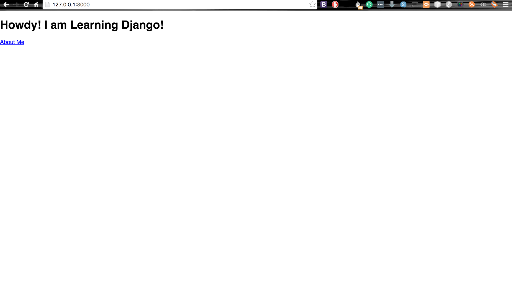
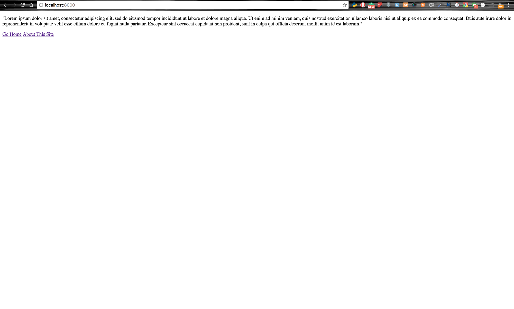
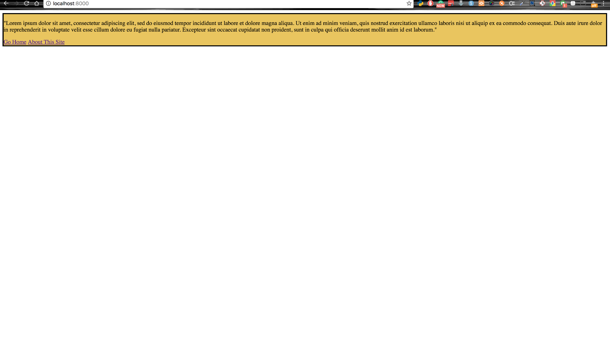
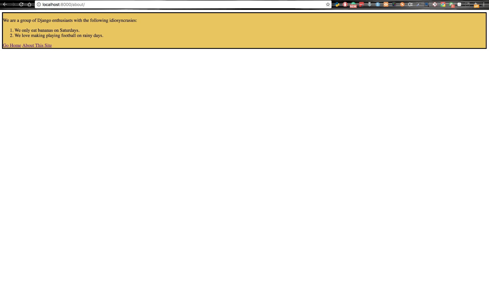
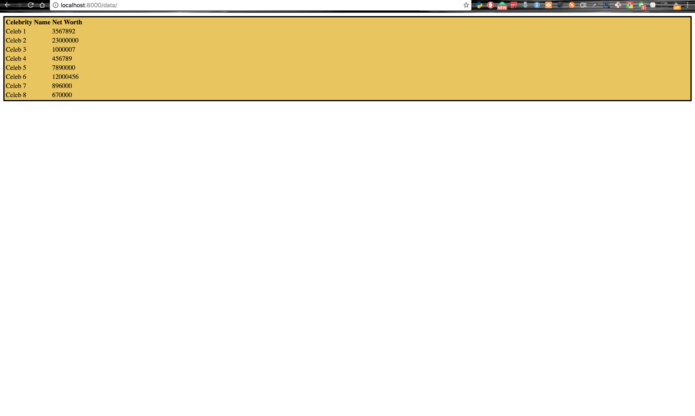
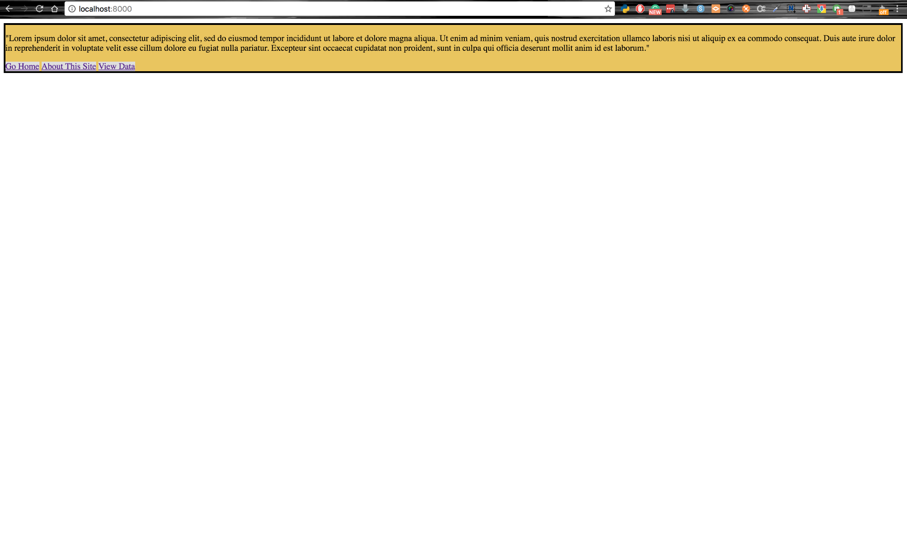
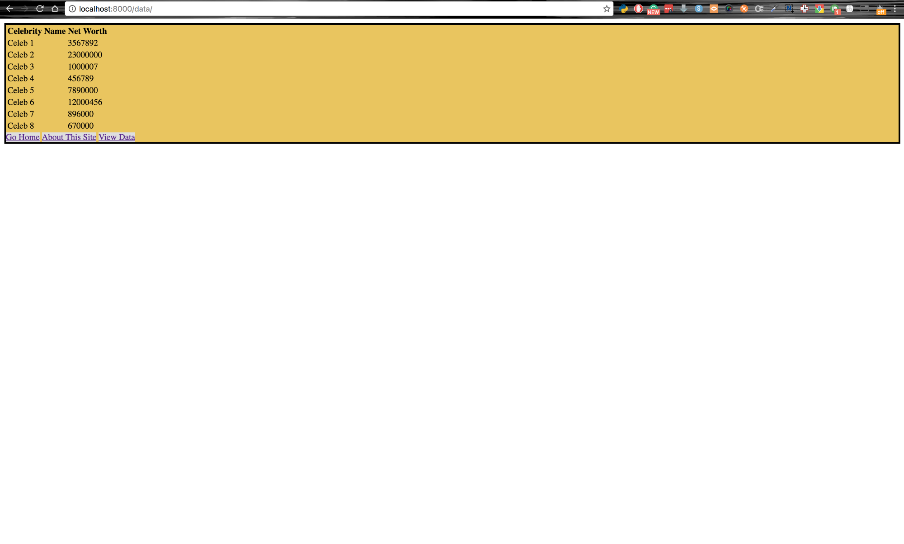
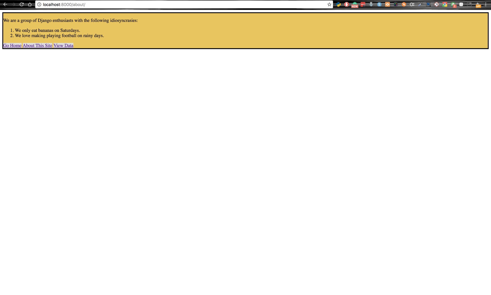

# Trabalhando com template Django e arquivos estáticos

Esse post é uma tradução [desse post](https://scotch.io/tutorials/working-with-django-templates-static-files)

No [tutorial anterior](primeira-aplicacao-em-django.html), foi mostrado como instalar e botar pra funcionar um site em Django. Mas os templates eram muito básicos.

Definitivamente não é assim que você deseja que seu site pareça:



Como você faz seu site ficar melhor? Simples! Adicione algum estilo. Neste tutorial, vou mostrar-lhe como adicionar alguns CSS e JavaScript para os seus templates Django, a fim de torná-los mais bonitos. Para fazer isso, primeiro você precisa entender o conceito de arquivos estáticos no Django.

---

## Configurando um projeto em Django

Vamos configurar o nosso projeto de teste do Django.

Primeiro crie um projeto com a ajuda do [virtualenvwrapper](https://virtualenvwrapper.readthedocs.io/en/latest/)

```
mkproject projects
```

Vamos agora usar pip para instalar o Django em nosso ambiente.

```
pip install django
```

Esse comando deve instalar o Django em seu ambiente. Até a data desse post, a versão de Django é 1.10.4.

Em seguida, vamos chamar o script `django-admin` para criar nossa aplicação em Django. Vamos fazer isso assim:

```
django-admin startproject djangotemplates
```

Se você verificar a estrutura de pastas de seus projetos, agora deverá ter uma nova pasta chamada `djangotemplates` criada pelo Django além da pasta anterior que criamos.

Dê um `cd` em `djangotemplates`

Sua estrutura de pasta agora deve ser semelhante a esta:

```
djangotemplates
--djangotemplates
----__init__.py
----settings.py
----urls.py
----wsgi.py
--manage.py
```

Tudo feito? Agora você está pronto para começar!

---

## Configurações para gerenciar arquivos estáticos

Arquivos estáticos incluem coisas como CSS, JavaScript e imagens que você pode querer servir ao lado de seu site. Django é muito opinativo sobre como você deve incluir seus arquivos estáticos. Neste artigo, vou mostrar como adicionar arquivos estáticos em uma aplicação Django.

Abra o arquivo `settings.py` dentro da pasta interna `djangotemplates`. Na parte inferior do arquivo você deve ver estas linhas:

```python
# djangotemplates/djangotemplates/settings.py

# Static files (CSS, JavaScript, Images)
# https://docs.djangoproject.com/en/1.10/howto/static-files/

STATIC_URL = '/static/'
```

Esta linha diz ao Django para anexar `static` na url base (no nosso caso `localhost:8000`) quando for procurar por arquivos estáticos. No Django, você poderia ter uma pasta `static` quase em qualquer lugar que você quiser. Você pode até ter mais de uma pasta `static`, uma em cada app por exemplo. No entanto, para manter as coisas simples, vou usar apenas uma pasta `static` na raíz da nossa pasta do projeto. Vamos criar uma mais tarde. Por enquanto, vamos adicionar algumas linhas no arquivo `settings.py` para que fique assim:

```python
# djangotemplates/djangotemplates/settings.py

# Static files (CSS, JavaScript, Images)
# https://docs.djangoproject.com/en/1.10/howto/static-files/

STATIC_URL = '/static/'

# Add these new lines
STATICFILES_DIRS = (
    os.path.join(BASE_DIR, 'static'),
)

STATIC_ROOT = os.path.join(BASE_DIR, 'staticfiles')
```

O tuple `STATICFILES_DIRS` diz ao Django onde procurar arquivos estáticos que não estão vinculados a nenhum app específico. Nesse caso, acabamos de dizer ao Django que também procure arquivos estáticos em uma pasta chamada `static` em nossa pasta raíz, e não apenas em nossos apps.

O Django também fornece um mecanismo para coletar arquivos estáticos em um único local para que possam ser facilmente servidos. Usando o comando `collectstatic`, o Django procura todos os arquivos estáticos em seus apps e entrega onde no lugar que você configurou o `STATIC_ROOT`. No nosso caso, estamos dizendo ao Django que, quando executamos `python manage.py collecttstatic`, reunimos todos os arquivos estáticos em uma pasta chamada `staticfiles` no diretório raíz do projeto. Esse recurso é muito útil para arquivos estáticos, especialmente em configurações de produção.

---

## Setup do App

Crie uma pasta chamada `static` no mesmo nível que a pasta interna `djangotemplates` e o arquivo `manage.py`. Agora você deve ter essa estrutura:

```
djangotemplates
--djangotemplates
----__init__.py
----settings.py
----urls.py
----wsgi.py
--static
--manage.py
```

Dentro desta pasta é onde vamos ter todos os CSS e JS. Vamos adicionar duas pastas dentro da pasta `static` para armazenar nossos arquivos, uma chamada `css` e a outra chamada `js`. Dentro da pasta `css`, crie um arquivo chamado `main.css`. Adicione um `main.js` na pasta `js` também. Sua pasta `static` deve agora ter esta aparência:

```
--static
----css
------main.cs
----js
------main.js
```

Uma vez feito isso, vamos criar um novo app chamado `example` com o qual estaremos trabalhando. Você se lembra de como fazer isso? Não se preocupe, é muito simples:

```
python manage.py startapp example
```

Uma vez feito isso, você deve ter uma pasta chamada `example` ao lado de `djangotemplates` e `static`. E é claro que você ainda poderá ver o arquivo `manage.py`

```
djangotemplates
--djangotemplates
----__init__.py
----settings.py
----urls.py
----wsgi.py
--example
--static
--manage.py
```

Precisamos informar o Django sobre nosso novo app. Vá para a pasta interna `djangotemplates`, abra `settings.py` e procure por `INSTALLED_APPS`. Adicione `example` junto com os outros apps.

```python
# djangotemplates/djangotemplates/settings.py

DEBUG = True

ALLOWED_HOSTS = []

# Application definition

INSTALLED_APPS = [
    'django.contrib.admin',
    'django.contrib.auth',
    'django.contrib.contenttypes',
    'django.contrib.sessions',
    'django.contrib.messages',
    'django.contrib.staticfiles',
    'example', # Add this line
]
```

Apenas para recapitular, agora temos a seguinte estrutura de pastas:

```
djangotemplates
--djangotemplates
----__init__.py
----settings.py
----urls.py
----wsgi.py
--example
----migrations
------__init__.py
----admin.py
----apps.py
----models.py
----tests.py
----views.py
--static
----css
------main.cs
----js
------main.js
--manage.py
```

## Definição de URL

Vamos definir uma URL para ir para o nosso novo app. Vamos editar `djangotemplates/djangotemplates/urls.py` para isso:

```python
# djangotemplates/djangotemplates/urls.py

from django.conf.urls import url, include # Add include to the imports here
from django.contrib import admin

urlpatterns = [
    url(r'^admin/', admin.site.urls),
    url(r'^', include('example.urls')) # tell django to read urls.py in example app
]
```

Depois disso, na pasta do app `example`, crie um novo arquivo chamado `urls.py` e adicione o seguinte código:

```python
# djangotemplates/example/urls.py

from django.conf.urls import url
from example import views

urlpatterns = [
    url(r'^$', views.HomePageView.as_view(), name='home'), # Notice the URL has been named
    url(r'^about/$', views.AboutPageView.as_view(), name='about'),
]
```

O código que acabamos de escrever indica ao Django que relacione uma rota vazia (isto é, `localhost:8000`) a uma view chamada `HomePageView` e a rota `/about/` para uma view chamada `AboutPageView`. Lembre-se, as views do Django aceitam requisições HTTP e retornam respostas HTTP. Em nosso caso, usaremos uma `TemplateView` que retorna um template de Página Inicial e outro para a página About. Para fazer isso, dentro de sua pasta do app `example`, crie outra pasta chamada `templates`. Dentro da nova pasta de templates, crie dois novos arquivos chamados `index.html` e `about.html`. A pasta do app `example` deve agora ter essa estrutura:

```
--example
----migrations
------__init__.py
----templates
------index.html
------about.html
----admin.py
----apps.py
----models.py
----tests.py
----urls.py
----views.py
```

Dentro do index.html, cole o seguinte código:

```html
<!-- djangotemplates/example/templates/index.html-->

<!DOCTYPE html>
<html lang="en">
<head>
  <meta charset="UTF-8">
  <title>Welcome Home</title>
</head>
<body>
  <p>"Lorem ipsum dolor sit amet, consectetur adipiscing elit, sed do eiusmod tempor incididunt ut labore et dolore magna aliqua. 
    Ut enim ad minim veniam, quis nostrud exercitation ullamco laboris nisi ut aliquip ex ea commodo consequat. 
    Duis aute irure dolor in reprehenderit in voluptate velit esse cillum dolore eu fugiat nulla pariatur. 
    Excepteur sint occaecat cupidatat non proident, sunt in culpa qui officia deserunt mollit anim id est laborum."
  </p>
  <a href="">Go Home</a>
  <a href="">About This Site</a>
</body>
</html>
```

E esse código na about.html:

```html
<!-- djangotemplates/example/templates/about.html-->

<!DOCTYPE html>
<html lang="en">
<head>
    <meta charset="UTF-8">
    <title>About Us</title>
</head>
<body>
  <p>
  We are a group of Django enthusiasts with the following idiosyncrasies:

  <ol>
    <li>We only eat bananas on Saturdays.</li>
    <li>We love making playing football on rainy days.</li>
  </ol>
  </p>
  <a href="">Go Home</a>
  <a href="">About This Site</a>
</body>
</html>
```

Observe como estamos nos referindo aos nossos links para `Go home` e `About This Site` em nossos temapltes. Podemos usar o recurso `automatic URL reverse lookup` do Django porque nomeamos nossas URLs no arquivo `urls.py`. 

Veremos o efeito desse código na próxima seção.

---

## Integrando as views

Vamos adicionar o código final para servir os nossos templates.
 
Precisamos editar `djangotemplates/example/views.py` para isso:

```python
# djangotemplates/example/views.py
from django.shortcuts import render
from django.views.generic import TemplateView # Import TemplateView

# Add the two views we have been talking about  all this time :)
class HomePageView(TemplateView):
    template_name = "index.html"

class AboutPageView(TemplateView):
    template_name = "about.html"
```

Agora podemos executar a nossa aplicação. Primeiro precisamos fazer as migrações padrão do Django, uma vez que esta é a primeira vez que estamos executando a nossa aplicação.

```
python manage.py migrate
```

Uma vez feito isso, inicie o servidor.

```
python manage.py runserver
```

Abra o navegador e navegue até `http://localhost:8000`. Você deve ser capaz de ver a home.



Clicando nos links na parte inferior deve ser possível navegar entre as páginas. Aqui está a página About:


## Herança de templates

Vamos mudar nosso foco para a pasta de templates dentro da pasta do app `example`. No momento, ele contém dois templates, `index.html` e `about.html`.

Gostaríamos que ambos os templates tenham alguns CSS. Em vez de reescrever o mesmo código em ambos, o Django nos permite criar um modelo base que ambos herdarão. Isso nos impede de ter que escrever um monte de código repetido em nossos templates quando precisamos modificar tudo o que é compartilhado.

Vamos criar o template base agora. Crie um arquivo chamado `base.html` em `djangotemplates/example/templates`. 

Escreva este código dentro dele:

```html
<!-- djangotemplates/example/templates/base.html -->


<!DOCTYPE html>
<html>
  <head>
    <meta charset="utf-8">
    <title>
      Django Sample Site - 
    </title>

    <script src=""></script> <!-- This is how to include a static file -->
    <link rel="stylesheet" href="" type="text/css" />
  </head>
  <body>
    <div class="container">
      
      
    </div>
  </body>
</html>
```



A primeira linha do arquivo, ``, usa a sintaxe de tag do template especial do Django para indicar ao template engine que use os arquivos na pasta `static` para esse template.

Na tag `title`, usamos um bloco Django. O que isto significa é que em qualquer template do Django que herda desse template de base, qualquer HTML que esteja dentro de um bloco chamado `title` será conectado ao bloco de título. O mesmo vale para o bloco de paginação da tag body. Se isso soa confuso, não se preocupe. Você vai vê-lo em ação em breve.

Se você não estiver executando o servidor Django, execute-o escrevendo `python manage.py runserver` no seu terminal. Vá para `http://localhost:8000`. Você deve ver o template anterior.




Agora edite o template `index.html` para herdar do template base.

```html
<!-- djangotemplates/example/templates/index.html -->

 <!-- Add this for inheritance -->

<!DOCTYPE html>
<html lang="en">
<head>
  <meta charset="UTF-8">
  <title>Welcome Home</title>
</head>
<body>
    <p>"Lorem ipsum dolor sit amet, consectetur adipiscing elit, sed do eiusmod tempor incididunt ut labore et dolore magna aliqua. 
      Ut enim ad minim veniam, quis nostrud exercitation ullamco laboris nisi ut aliquip ex ea commodo consequat. 
      Duis aute irure dolor in reprehenderit in voluptate velit esse cillum dolore eu fugiat nulla pariatur. 
      Excepteur sint occaecat cupidatat non proident, sunt in culpa qui officia deserunt mollit anim id est laborum."
    </p>
    <a href="">Go Home</a>
    <a href="">About This Site</a>
</body>
</html>
```

Recarregue a página no seu navegador. Nada aparece! Isso ocorre porque o Django espera que seu conteúdo seja escrito dentro dos blocos que definimos no template base para que possam ser renderizados. Edite o `index.html` para adicionar os blocos:

```html
<!-- djangotemplates/example/templates/index.html -->



<!DOCTYPE html>
<html lang="en">
<head>
  <meta charset="UTF-8">
  <title>Welcome Home </title>
</head>
<body>
  
    <p>"Lorem ipsum dolor sit amet, consectetur adipiscing elit, sed do eiusmod tempor incididunt ut labore et dolore magna aliqua. 
      Ut enim ad minim veniam, quis nostrud exercitation ullamco laboris nisi ut aliquip ex ea commodo consequat. 
      Duis aute irure dolor in reprehenderit in voluptate velit esse cillum dolore eu fugiat nulla pariatur. 
      Excepteur sint occaecat cupidatat non proident, sunt in culpa qui officia deserunt mollit anim id est laborum."
    </p>
    <a href="">Go Home</a>
    <a href="">About This Site</a>
  
</body>
</html>
```

Recarregue a página no navegador e voila! Seu conteúdo deve aparecer novamente:


Também podemos editar o template about.html para usar o mesmo:

```html
<!-- djangotemplates/example/templates/about.html -->

 <!-- Add this for inheritance -->

<!DOCTYPE html>
<html lang="en">
<head>
    <meta charset="UTF-8">
    <title>About Us </title>
</head>
<body>
  
    <p>
    We are a group of Django enthusiasts with the following idiosyncrasies:

    <ol>
        <li>We only eat bananas on Saturdays.</li>
        <li>We love making playing football on rainy days.</li>
    </ol>
    </p>
    <a href="">Go Home</a>
    <a href="">About This Site</a>
  
</body>
</html>
```

Agora você deve ver isso na página About:


Que é exatamente o mesmo de antes!

No entanto, agora, uma vez que ambos os modelos herdam de um template base, eu posso facilmente estilizá-los. Abra o main.css na sua pasta css e adicione estes estilos:

```css
.container {
    background: #eac656;
    margin: 10 10 10 10;
    border: 3px solid black;
}
```

Isso vai estilizar a div container que estamos carregando o nosso conteúdo. Dê um refresh seu navegador. Você deve ver isso:

Página inicial:



Página About:



---

## Renderizando templates com dados vindos da view

Você pode usar a template engine do Django para exibir dados nos templates. Nesta seção, vou criar uma view do Django que passará dados para um template. Vou então mostrar-lhe como acessar esses dados no template e exibi-lo para o usuário.

Primeiro, abra `views.py` na pasta do app `example`. Vamos adicionar uma nova view para servir dados em nosso template `data.html` ainda existente. Modifique o arquivo `views.py` para que fique assim:

```python
# djangotemplates/example/views.py

from django.shortcuts import render
from django.views.generic import TemplateView

class HomePageView(TemplateView):
    template_name = "index.html"

class AboutPageView(TemplateView):
    template_name = "about.html"

# Add this view
class DataPageView(TemplateView):
    def get(self, request, **kwargs):
        # we will pass this context object into the
        # template so that we can access the data
        # list in the template
        context = {
            'data': [
                {
                    'name': 'Celeb 1',
                    'worth': '3567892'
                },
                {
                    'name': 'Celeb 2',
                    'worth': '23000000'
                },
                {
                    'name': 'Celeb 3',
                    'worth': '1000007'
                },
                {
                    'name': 'Celeb 4',
                    'worth': '456789'
                },
                {
                    'name': 'Celeb 5',
                    'worth': '7890000'
                },
                {
                    'name': 'Celeb 6',
                    'worth': '12000456'
                },
                {
                    'name': 'Celeb 7',
                    'worth': '896000'
                },
                {
                    'name': 'Celeb 8',
                    'worth': '670000'
                }
            ]
        }

        return render(request, 'data.html', context)
```

Estamos usando o mesmo tipo de view que usamos para processar os outros templates. No entanto, agora estamos passando um objeto de `context` para o método de renderização. Os pares chave-valor definidos no context estarão disponíveis no template que está sendo renderizado, e podemos iterar através deles como qualquer outra lista.

Para terminar, acesse o arquivo `urls.py` no app `howdy` e adicione o padrão de URL para nossa nova view, para que fique assim:

```python
# djangotemplates/example/urls.py

from django.conf.urls import url
from example import views

urlpatterns = [
    url(r'^$', views.HomePageView.as_view(), name='home'),
    url(r'^about/$', views.AboutPageView.as_view(), name='about'),
    url(r'^data/$', views.DataPageView.as_view(), name='data'),  # Add this URL pattern
]
```

Por fim, vamos criar o template. Na pasta de templates, crie um arquivo chamado `data.html` e escreva esse código dentro dele:

```html
<!-- djangotemplates/example/templates/data.html -->


<!DOCTYPE html>
<html>
  <head>
    <meta charset="utf-8">
    <title></title>
  </head>
  <body>
    
    <div class="table-div">
    <!-- We will display our data in a normal HTML table using Django's
    template for-loop to generate our table rows for us-->
      <table class="table">
        <thead>
          <tr>
            <th>Celebrity Name</th>
            <th>Net Worth</th>
          </tr>
        </thead>
        <tbody>
          
            <tr>
              <td>{{ celebrity.name }}</td>
              <td>{{ celebrity.worth }}</td>
            </tr>
          
        </tbody>
      </table>
    </div>
    
  </body>
</html>
```

No arquivo `data.html`, você pode ver que usamos o que é essencialmente um `for` loop para percorrer a lista de dados. A vinculação de valores em templates do Django é feita usando `{{}}` colchetes como no AngularJS.

Com o servidor em execução, vá para `http://localhost:8000/data/` para ver o template:



---

## Incluindo snippets em seus templates

Agora temos três templates, `index.html`, `about.html` e `data.html`. Vamos uni-los usando uma simples barra de navegação. Primeiro, vamos escrever o código para a barra de navegação em outro template HTML.

Na pasta de templates dentro do app `example`, crie uma nova pasta chamada `partials`. Dentro dela, crie um arquivo chamado `nav-bar.html`. A estrutura de pasta de templates agora deve ser assim:

```
templates
----index.html
----about.html
----data.html
----partials
------nav-bar.html
```

Edite o arquivo `nav-bar.html` para que ele contenha esse código:

```html
<!-- djangotemplates/example/templates/partials/nav-bar.html -->

<div class="nav">
  <a href="">Go Home</a>
  <a href="">About This Site</a>
  <a href="">View Data</a>
</div>
```

Incluir snippets em um template é muito simples. Usamos a palavra-chave `includes` fornecida pelo template engine do Django. Vá em frente e modifique o `index.html` para isso:

```html
<!-- djangotemplates/example/templates/index.html -->



<!DOCTYPE html>
<html lang="en">
<head>
  <meta charset="UTF-8">
  <title>Welcome Home </title>
</head>
<body>
  
    <p>"Lorem ipsum dolor sit amet, consectetur adipiscing elit, sed do eiusmod tempor incididunt ut labore et dolore magna aliqua. 
      Ut enim ad minim veniam, quis nostrud exercitation ullamco laboris nisi ut aliquip ex ea commodo consequat. 
      Duis aute irure dolor in reprehenderit in voluptate velit esse cillum dolore eu fugiat nulla pariatur. 
      Excepteur sint occaecat cupidatat non proident, sunt in culpa qui officia deserunt mollit anim id est laborum."
    </p>
     <!--Add this-->

    <!-- Remove these two lines -- >
    <!-- <a href="">Go Home</a> -->
    <!-- <a href="">About This Site</a> -->
  
</body>
</html>
```

Modifique o `about.html` para isso:

```html
<!-- djangotemplates/example/templates/about.html -->



<!DOCTYPE html>
<html lang="en">
<head>
    <meta charset="UTF-8">
    <title>About Us </title>
</head>
<body>
  
    <p>
    We are a group of Django enthusiasts with the following idiosyncrasies:

    <ol>
        <li>We only eat bananas on Saturdays.</li>
        <li>We love making playing football on rainy days.</li>
    </ol>
    </p>
     <!--Add this-->

    <!-- Remove these two lines -- >
    <!-- <a href="">Go Home</a> -->
    <!-- <a href="">About This Site</a> -->
  
</body>
</html>
```

E por último modifique o `data.html`

```html
<!-- djangotemplates/example/templates/data.html -->


<!DOCTYPE html>
<html>
  <head>
    <meta charset="utf-8">
    <title></title>
  </head>
  <body>
    
    <div class="table-div">
      <table class="table">
        <thead>
          <tr>
            <th>Celebrity Name</th>
            <th>Net Worth</th>
          </tr>
        </thead>
        <tbody>
          
            <tr>
              <td>{{ celebrity.name }}</td>
              <td>{{ celebrity.worth }}</td>
            </tr>
          
        </tbody>
      </table>
    </div>
     <!--Add this-->
    
  </body>
</html>
```

Hora de verificar o nosso trabalho! Abra o navegador e navegue até `http://localhost:8000`.
 
Você deve ver isso:



Todas as páginas agora estão ligadas com a navbar para que você possa facilmente navegar de um lado para outro através deles, todos com o mínimo de código escrito. Aqui está o template `data.html`:



E o `about.html`



Agora foi adicionado o seguinte CSS para estilizar os links na barra de navegação. Fique à vontade para usá-lo ou usar seus próprios estilos:

```css
// djangtotemplates/static/css/main.css

.container {
    background: #eac656;
    margin: 10 10 10 10;
    border: 3px solid black;
}

.nav a {
    background: #dedede;
}
```

## Filtros

Os filtros pegam os dados passados para eles e os formatam. Os templates do Django têm acesso à coleção `humanize` de filtros, que tornam os dados mais legíveis para o usuário. Vamos fazer com que o campo `networth` da celebridade no template de dados seja mais legível usando alguns desses filtros.

Para usar os filtros `humanize` do Django, primeiro você precisa editar algumas configurações. Abra `djangotemplates/settings.py` e edite a lista `INSTALLED_APPS` para isso:

```python
# djangotemplates/djangotemplates/settings.py

ALLOWED_HOSTS = []

# Application definition

INSTALLED_APPS = [
    'django.contrib.admin',
    'django.contrib.auth',
    'django.contrib.contenttypes',
    'django.contrib.sessions',
    'django.contrib.messages',
    'django.contrib.staticfiles',
    'django.contrib.humanize', # Add this line. Don't forget the trailing comma
    'example',
]
```

Agora podemos usar um filtro em nossos templates. Vamos usar o filtro `intcomma` para adicionar vírgulas em números muito grandes para torná-los mais fáceis de ler. Vamos modificar `data.html` para isso:

```html
<!-- djangotemplates/example/templates/data.html -->


 <!-- Add this-->

<!DOCTYPE html>
<html>
  <head>
    <meta charset="utf-8">
    <title></title>
  </head>
  <body>
    
    <div class="table-div">
      <table class="table">
        <thead>
          <tr>
            <th>Celebrity Name</th>
            <th>Net Worth</th>
          </tr>
        </thead>
        <tbody>
          
            <tr>
              <td>{{ celebrity.name }}</td>
              <td>$ {{ celebrity.worth | intcomma }}</td> <!--Modify this line-->
            </tr>
          
        </tbody>
      </table>
    </div>
    
    
  </body>
</html>
```

Quando você vai para `http://localhost:8000/data/`, agora você deve ter uma lista mais amigável de valores de patrimônio líquido:


Há muitos mais filtros incluídos no pacote de filtros `humanize`. Leia sobre eles [aqui](https://docs.djangoproject.com/en/1.10/ref/contrib/humanize/)

---

## Coletando arquivos estáticos

Lembre-se que conversamos sobre a coleta de arquivos estáticos? Experimente o seguinte comando:

```
python manage.py collectstatic
```

Você deve ver um prompt como o seguinte:

```
You have requested to collect static files at the destination
location as specified in your settings:

      /Users/amos/projects/djangotemplates/staticfiles

This will overwrite existing files!
Are you sure you want to do this?

Type 'yes' to continue, or 'no' to cancel: 
```

Vá em frente e escreva `sim`.

Este comando pedirá ao Django para percorrer todas as pastas do seu projeto, procurar todos os arquivos estáticos e armazená-los em um lugar (a pasta estática raíz que definimos nas configurações). Isso é muito eficiente, especialmente se você estiver fazendo deploy do seu site para a produção.

Quando você executa o comando `collectstatic`, você deve ver uma nova pasta chamada `staticfiles` criada na raíz da pasta do seu projeto. Você pode alterar esse local para outro editando a configuração da pasta estática raíz, definida no arquivo `settings.py` do seu projeto. Para usar esses arquivos estáticos, em seus templates você dirá escreverá `load staticfiles` ao invéz de `load static`. Todo o resto é o mesmo que usando a pasta `static` anterior.

## Conclusão

Parabéns por ter chegado ao final deste tutorial! Até agora você deve ter uma compreensão mais detalhada de como funcionam os templates no Django. Se você precisa de informações mais profundas, lembre-se que a documentação é sua amiga. Você pode encontrar o código completo para este tutorial [aqui](https://github.com/andela-aomondi/djangotemplates). 
